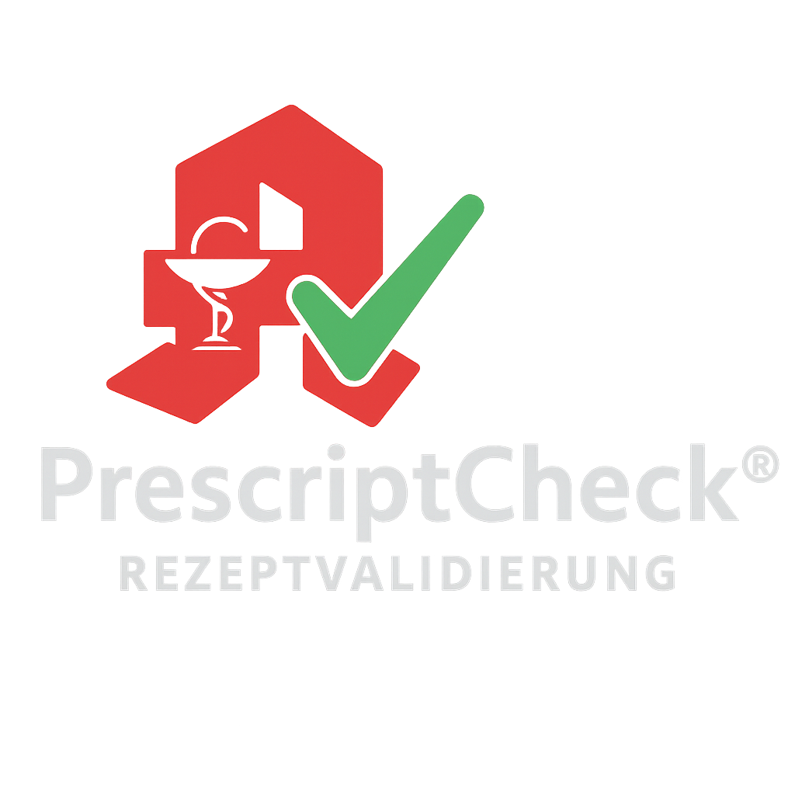

<p align="center">
  
</p>

<p align="center"><strong>Digitale Rezeptvalidierung für Privatrezepte – Secure prescription validation made in Germany</strong></p>

<p align="center">
  <a href="#features">Features</a> •
  <a href="#installation">Installation</a> •
  <a href="#usage--nutzung">Nutzung</a> •
  <a href="#contributing--mitmachen">Mitmachen</a> •
  <a href="#license--lizenz">Lizenz</a>
</p>

---

## Initial Public Release – Version 0.1.0

Diese Version enthält:
- Grundstruktur für Rezeptvalidierung
- Apothekenportal mit Echtzeitprüfung
- Lizenzmanagement über Stripe, PayPal & Klarna
- Admin-Dashboard & Benutzerverwaltung
- Vorbereitungen für Videosprechstunden-Modul

> Hinweis: Diese Version markiert den ersten öffentlichen Stand des Projekts.

---

## Projektbeschreibung / Project Overview

PrescriptCheck ist ein innovatives System zur Validierung von Privatrezepten. Es ermöglicht Ärzt:innen, fälschungssichere Rezepte zu erstellen, und Apotheken, die Echtheit dieser Rezepte über eine sichere Plattform zu überprüfen – digital, effizient und gesetzeskonform.

PrescriptCheck is an innovative prescription validation platform for private prescriptions in Germany. It enables doctors to issue tamper-proof prescriptions and pharmacies to verify authenticity via a secure, real-time system.

---

## Features

- Rezeptausstellung mit QR-Validierung & Sicherheitscode  
- Druck- & Einlöseverfolgung  
- Echtzeitprüfung für Apotheken  
- Lizenzmanagement (Stripe, PayPal, Klarna)  
- Patientenakte mit Verlauf & Vorlagen  
- Digitale Signatur, Audit-Logs, verschlüsselte Exporte  
- Videosprechstunde & Dashboard  

---

## Installation

### Voraussetzungen / Requirements

- Node.js >= 20
- MongoDB (Atlas oder lokal)
- PM2 (für Production Mode)
- nginx (für Reverse Proxy)
- Git

### Lokale Installation

```bash
git clone https://github.com/at-medical/prescriptcheck.git
cd prescriptcheck
npm install
cp .env.example .env
npm run dev
```

---

## Usage / Nutzung

- **Ärzt:innen-Portal:** Rezepte erstellen, verwalten & validieren  
  Das Portal ermöglicht die Ausstellung, Verwaltung und Validierung digitaler Privatrezepte.
- **Apothekenportal:** Validierung & Einlösung dokumentieren  
  Apotheken können Rezepte auf Gültigkeit prüfen, Einlösungen erfassen und die Verordnungshistorie einsehen.
- **Adminbereich:** Lizenzverwaltung, Sicherheitsprotokolle, Statistik  
  Die Administrationsoberfläche dient der Lizenzsteuerung, Audit-Kontrolle und dem Nutzungsmonitoring.

**Start im Produktionsmodus:**

```bash
npm run start:prod
```

---

## Contributing / Mitmachen

Wir freuen uns über Beiträge jeder Art – ob Code, Feedback, Bug-Meldungen oder neue Feature-Ideen!

### So kannst du mitwirken:

1. Forke das Projekt  
2. Erstelle einen Feature-Branch:  
   `git checkout -b feature/meine-änderung`
3. Nimm deine Änderungen vor und committe sie:  
   `git commit -m "Neue Funktion hinzugefügt"`
4. Push den Branch und öffne einen Pull Request:  
   `git push origin feature/meine-änderung`

### Code Style:

- 2 Leerzeichen für Einrückung  
- Bitte ESLint verwenden  
- Aussagekräftige Commits  
- Pull Requests mit klarer Beschreibung

### Sicherheitshinweise:

Kritische Schwachstellen bitte **nicht öffentlich posten**, sondern per Mail an:

**support@at-medical.de**

---

## License / Lizenz

MIT License

Copyright (c) 2025 AT Medical GmbH

Permission is hereby granted, free of charge, to any person obtaining a copy
of this software and associated documentation files (the "Software"), to deal
in the Software without restriction, including without limitation the rights
to use, copy, modify, merge, publish, distribute, sublicense, and/or sell
copies of the Software, and to permit persons to whom the Software is
furnished to do so, subject to the following conditions:

Der obige Copyright-Hinweis und dieser Genehmigungshinweis müssen in allen
Kopien oder wesentlichen Teilen der Software enthalten sein.

DIE SOFTWARE WIRD OHNE JEGLICHE GARANTIE BEREITGESTELLT, AUSDRÜCKLICH ODER
IMPLIZIERT, EINSCHLIESSLICH DER GARANTIEN DER MARKTGÄNGIGKEIT, DER EIGNUNG FÜR
EINEN BESTIMMTEN ZWECK UND DER NICHTVERLETZUNG. IN KEINEM FALL SIND DIE AUTOREN
ODER COPYRIGHTINHABER FÜR ANSPRÜCHE, SCHÄDEN ODER SONSTIGE HAFTUNG
VERANTWORTLICH, OB IN EINEM VERTRAGSVERHÄLTNIS, EINEM DELIKT ODER ANDERWEITIG,
AUS ODER IN VERBINDUNG MIT DER SOFTWARE ODER DER VERWENDUNG ODER ANDEREN
UMGÄNGEN MIT DER SOFTWARE.